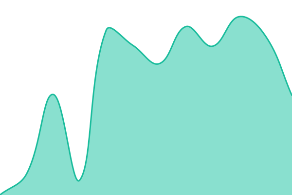
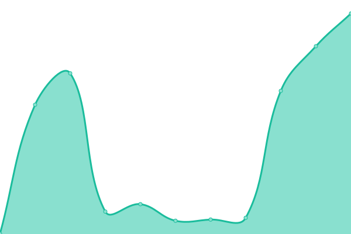
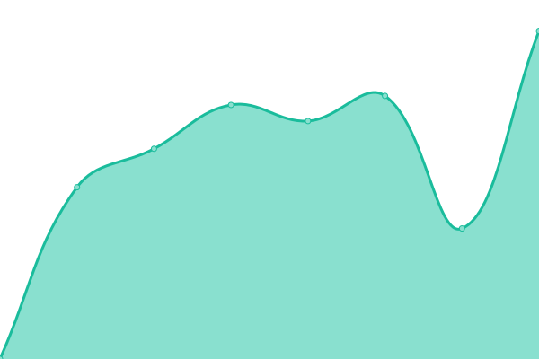
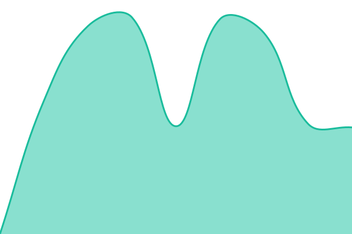

# [📈 Live Status](https://CoryManson.github.io/manson-uptime): <!--live status--> **🟥 Complete outage**

This repository contains the open-source uptime monitor and status page for [CManson](https://CoryManson.github.io/manson-uptime), powered by [Upptime](https://github.com/upptime/upptime).

With [Upptime](https://upptime.js.org), you can get your own unlimited and free uptime monitor and status page, powered entirely by a GitHub repository. We use [Issues](https://github.com/CoryManson/manson-uptime/issues) as incident reports, [Actions](https://github.com/CoryManson/manson-uptime/actions) as uptime monitors, and [Pages](https://CoryManson.github.io/manson-uptime) for the status page.

<!--start: status pages-->
<!-- This summary is generated by Upptime (https://github.com/upptime/upptime) -->
<!-- Do not edit this manually, your changes will be overwritten -->
<!-- prettier-ignore -->
| URL | Status | History | Response Time | Uptime |
| --- | ------ | ------- | ------------- | ------ |
|  Homepage | 🟥 Down | [homepage.yml](https://github.com/CoryManson/manson-uptime/commits/HEAD/history/homepage.yml) | 

 561ms
     
 | 

<a href="https://CoryManson.github.io/manson-uptime/history/homepage">64.02%</a>
    

|  Recipe Book | 🟥 Down | [recipe-book.yml](https://github.com/CoryManson/manson-uptime/commits/HEAD/history/recipe-book.yml) | 

 440ms
     
 | 

<a href="https://CoryManson.github.io/manson-uptime/history/recipe-book">64.02%</a>
    

|  Nextcloud | 🟥 Down | [nextcloud.yml](https://github.com/CoryManson/manson-uptime/commits/HEAD/history/nextcloud.yml) | 

 659ms
     
 | 

<a href="https://CoryManson.github.io/manson-uptime/history/nextcloud">64.02%</a>
    

|  Calibre | 🟥 Down | [calibre.yml](https://github.com/CoryManson/manson-uptime/commits/HEAD/history/calibre.yml) | 

 502ms
     
 | 

<a href="https://CoryManson.github.io/manson-uptime/history/calibre">64.23%</a>
    

|  Bitwarden | 🟥 Down | [bitwarden.yml](https://github.com/CoryManson/manson-uptime/commits/HEAD/history/bitwarden.yml) | 

 483ms
     
 | 

<a href="https://CoryManson.github.io/manson-uptime/history/bitwarden">64.23%</a>
    

|  Plex | 🟥 Down | [plex.yml](https://github.com/CoryManson/manson-uptime/commits/HEAD/history/plex.yml) | 

 397ms
     
 | 

<a href="https://CoryManson.github.io/manson-uptime/history/plex">64.82%</a>
    

<!--end: status pages-->

[**Visit our status website →**](https://CoryManson.github.io/manson-uptime)

## 📄 License

- Powered by: [Upptime](https://github.com/upptime/upptime)
- Code: [MIT](./LICENSE) © [Anand Chowdhary](https://anandchowdhary.com), supported by [Pabio](https://pabio.com)
- Data in the `./history` directory: [Open Database License](https://opendatacommons.org/licenses/odbl/1-0/)
